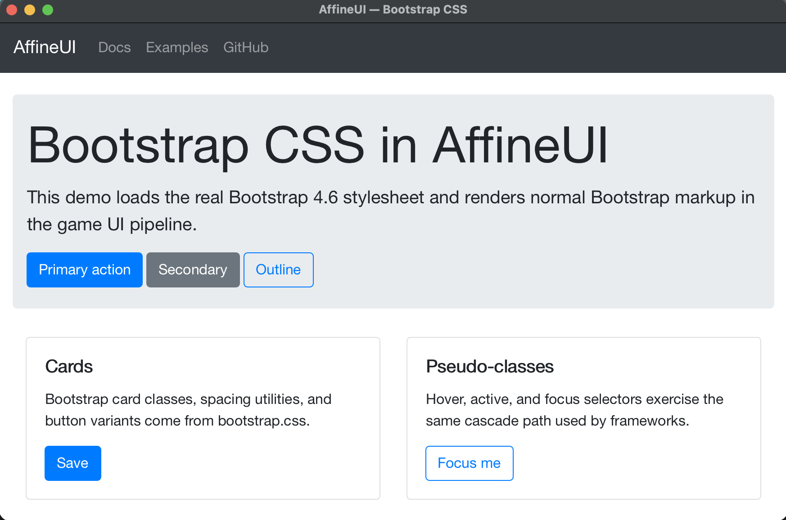

# AffineUI

AffineUI is a .cpp .h two source file zero dependency GPU-accelerated HTML5/CSS browser layout and rendering
engine for C++ games, editors, tools, and other native projects.

AffineUI focuses on support for the browser features modern CSS
component frameworks need to function: Bootstrap, Material UI,
Tailwind-style utility systems, Ant-style component markup, and similar
HTML/CSS UI libraries. The same runtime supports in-game UI, debug UI,
editor panels, launchers, store panels, settings, and internal tooling.

The checked-in [`examples/01_bootstrap`](examples/01_bootstrap) demo
loads the real Bootstrap 4.6 CSS library and renders standard
Bootstrap containers, navbars, cards, buttons, and pseudo-class states.
Bootstrap JavaScript components will be mapped to native C++ behavior
rather than browser JavaScript.



## Project Status

AffineUI is **alpha-stage software**.

The core renderer and layout engine are already capable of running substantial real-world HTML/CSS, including many Bootstrap, Tailwind, and Ant-style layouts. However, the implementation is still incomplete and has many known bugs in standards compliance, layout edge cases, rendering behavior, and framework compatibility.

This is not yet a production-ready browser engine or a drop-in replacement for Chromium/WebKit. It is an in-progress native C++ HTML/CSS UI renderer intended for games, tools, and embedded native applications.

Expect bugs. Expect missing features. Expect some web pages or frameworks to require workarounds.

The goal of the project is ambitious: practical browser-style UI rendering in native C++ without embedding a browser or pulling in a large dependency stack.

## Adding AffineUI to Your Game or App

Download and add these two zero-dependency files to your project.

- [`dist/affineui.h`](dist/affineui.h)
- [`dist/affineui.cpp`](dist/affineui.cpp)

Compile `affineui.cpp` once as C++20 and include `affineui.h` from
your game code.

Place `bootstrap-4.6.2.min.css` next to `Hello.html`, then create this
Bootstrap card:

```html
<!doctype html>
<html>
<head>
  <link rel="stylesheet" href="bootstrap-4.6.2.min.css">
</head>
<body>
  <main class="container py-4">
    <section class="card">
      <div class="card-body">
        <h1 class="card-title display-4">Hello from AffineUI</h1>
        <p class="card-text">
          Real Bootstrap CSS rendered inside your game.
        </p>
        <button class="btn btn-primary">Continue</button>
      </div>
    </section>
  </main>
</body>
</html>
```

Load it once at startup:

```cpp
affineui::Ui ui;
if (!ui.load("Hello.html")) {
    ui.html("<main>Hello from AffineUI</main>");
}
```

For SDL based projects, forward SDL events to AffineUI and render the
UI before swapping the window:

```cpp
#define AFFINEUI_WITH_SDL
#include "affineui.h"

affineui::Ui ui;
ui.load("Hello.html");

while (running) {
    SDL_Event ev;
    while (SDL_PollEvent(&ev)) {
        if (affineui::sdl::dispatch(ui, ev)) continue;
    }

    affineui::sdl::render(ui, window);
    SDL_GL_SwapWindow(window);
}
```

For Sokol projects, wire the UI into `sokol_app`:

```cpp
#define AFFINEUI_WITH_SOKOL
#include "affineui.h"

int main() {
    affineui::Ui ui;
    ui.load("Hello.html");

    sapp_desc desc{};
    desc.width = 1024;
    desc.height = 768;
    desc.window_title = "Hello";
    affineui::sokol::wire(desc, ui);
    sapp_run(&desc);
}
```

Integrating into other code (hand authored integration):

```cpp
affineui::Ui ui;
ui.load("Hello.html");

// Translate host mouse/key input into affineui::Event.
ui.dispatch(event);

// Render once per frame into the current framebuffer.
ui.render(framebuffer_width, framebuffer_height, dpi_scale);
```

## Why AffineUI?

AffineUI exposes both a retained DOM API and a Dear ImGui-shaped
immediate-mode C++ API over one style, layout, input, and rendering
pipeline, with simple integration for SDL2 and sokol_app window
frameworks.

AffineUI does not include JavaScript, video, navigation, networking, or
a full browser platform.

## Advantages

- Full-featured browser-style layout and rendering without Electron,
  CEF, JavaScript, or a large browser framework.
- Standards-based UI for in-game UI, debug UI, editor panels, launchers,
  store panels, settings, native tools, and internal tooling.
- HTML/CSS authoring for designer-owned surfaces; modern CSS component
  frameworks are target inputs.
- Immediate-mode C++ API for Dear ImGui-style workflows; retained DOM
  API for document-driven workflows.
- Simple native frame-loop integration with SDL2 and sokol_app; manual
  event/render glue for other window frameworks.
- Entire SDK library ships as `affineui.h` and `affineui.cpp`; no
  package manager, runtime DLL, or third-party source tree.

## Artifacts

The checked-in SDK artifacts are
[`dist/affineui.h`](dist/affineui.h) and
[`dist/affineui.cpp`](dist/affineui.cpp). Add both files to the host
project. Compile `affineui.cpp` once as C++20. Include `affineui.h`
from game/tool code. No external include directories are required.

Current GL backend defines:

```text
SOKOL_GLCORE
SOKOL_NO_ENTRY
AFFINEUI_BACKEND_GL
```

## SDL2

Build:

```cmake
add_library(affineui STATIC
    third_party/affineui/dist/affineui.cpp)

target_compile_features(affineui PUBLIC cxx_std_20)
target_compile_definitions(affineui PUBLIC
    AFFINEUI_WITH_SDL
    SOKOL_GLCORE
    SOKOL_NO_ENTRY
    AFFINEUI_BACKEND_GL)
target_include_directories(affineui PUBLIC third_party/affineui/dist)
target_link_libraries(affineui PUBLIC SDL2::SDL2)

target_sources(my_app PRIVATE main.cpp)
target_link_libraries(my_app PRIVATE affineui)
```

Use:

```cpp
#define AFFINEUI_WITH_SDL
#include "affineui.h"
#include <SDL.h>

affineui::Ui ui;
ui.html(R"(<button id="quit">Quit</button>)");

while (running) {
    SDL_Event ev;
    while (SDL_PollEvent(&ev)) {
        if (affineui::sdl::dispatch(ui, ev)) continue;
        // host input
    }

    // host rendering
    affineui::sdl::render(ui, window);
    SDL_GL_SwapWindow(window);
}
```

## sokol_app

Build:

```cmake
add_library(affineui STATIC
    third_party/affineui/dist/affineui.cpp)

target_compile_features(affineui PUBLIC cxx_std_20)
target_compile_definitions(affineui PUBLIC
    AFFINEUI_WITH_SOKOL
    SOKOL_GLCORE
    SOKOL_NO_ENTRY
    AFFINEUI_BACKEND_GL)
target_include_directories(affineui PUBLIC third_party/affineui/dist)

target_sources(my_app PRIVATE main.cpp)
target_link_libraries(my_app PRIVATE affineui)
```

Use:

```cpp
#define AFFINEUI_WITH_SOKOL
#include "affineui.h"
#include <sokol_log.h>

int main() {
    affineui::Ui ui;
    ui.html(R"(<button id="quit">Quit</button>)");
    ui.on_click("#quit", []{ sapp_request_quit(); });

    sapp_desc desc{};
    desc.width = 1024; desc.height = 768;
    desc.window_title = "My Game";
    desc.high_dpi = true;
    desc.logger.func = slog_func;
    affineui::sokol::wire(desc, ui);   // installs frame + event callbacks
    sapp_run(&desc);
    return 0;
}
```

## Compile-Time Switches

| Macro | Use |
|---|---|
| `AFFINEUI_WITH_SDL` | Include the SDL2 adapter from `affineui.h`. |
| `AFFINEUI_WITH_SOKOL` | Include the sokol_app adapter from `affineui.h`. |
| `AFFINEUI_NO_IMM` | Omit the immediate-mode layer from the public header. |
| `AFFINEUI_NO_C_API` | Omit the C ABI surface. |
| `AFFINEUI_HTML_ENTITIES_FULL` | Enable Lexbor's full HTML5 named character entity table. Default builds use a compact common-entity table. |
| `AFFINEUI_HOST_PROVIDES_SOKOL` | Do not emit sokol implementation symbols. |
| `AFFINEUI_HOST_PROVIDES_NANOVG` | Do not emit NanoVG implementation symbols. |
| `AFFINEUI_HOST_PROVIDES_STB_IMAGE` | Do not emit stb_image implementation symbols. |
| `AFFINEUI_HOST_PROVIDES_STB_TRUETYPE` | Do not emit stb_truetype implementation symbols. |
| `AFFINEUI_HOST_PROVIDES_FONTSTASH` | Do not emit fontstash implementation symbols. |

For CMake builds, set `-DAFFINEUI_HTML_ENTITIES_FULL=ON`. For the
two-file SDK, define `AFFINEUI_HTML_ENTITIES_FULL` when compiling
`affineui.cpp`.

## Adapter coverage

| Adapter | Windowing | Graphics (today) | Graphics (Phase 3+) |
|---|---|---|---|
| `affineui::sokol` | sokol_app — Win/Mac/Linux/iOS/Android/Web | GL3 | Metal, D3D11, WebGPU via sokol_gfx |
| `affineui::sdl` | SDL2 — Win/Mac/Linux/iOS/Android/Web | GL3 | Metal (SDL_Metal), D3D11 |
| Manual | yours | GL3 | per your stack |

Both adapter paths give you **HiDPI handling, cursor changes,
high-precision input, and CSS-selector click routing** out of the box.

## What you get without writing CSS

Default styles via the user-agent stylesheet ship with the engine. A
blank document still renders readable, sensibly-spaced HTML.

## Two ways to drive content

**Retained:** call `ui.html("...")` once at setup; mutate via DOM-ish
methods or replace wholesale when state changes.

**Immediate (Dear ImGui-shaped):** describe the UI with ordinary C++
calls like `imm::div()`, `imm::button()`, `imm::text()`, and
`imm::use_state()`. The call pattern should feel familiar if you are
already shipping Dear ImGui panels, but the output is a retained
HTML/CSS DOM. AffineUI diffs the view against the previous tree and
patches the DOM; painting still happens every frame off the retained
tree, so CSS hover/focus/animation can keep running without re-entering
your view function.

See [`docs/ARCHITECTURE.md`](docs/ARCHITECTURE.md) for the engine's
internal shape.

## Stack

| Layer | Library | License | Why |
|---|---|---|---|
| HTML5 + CSS parsing, DOM, selector matching | [lexbor](https://github.com/lexbor/lexbor) | Apache-2 | Spec-pedantic, maintained |
| Flexbox math | [Yoga](https://github.com/facebook/yoga) | MIT | Battle-tested via React Native |
| 2D vector painter | [NanoVG](https://github.com/memononen/nanovg) | zlib | Antialiased strokes/fills/gradients/text |
| Sokol windowing | [sokol](https://github.com/floooh/sokol) | zlib | Cross-platform window + GPU abstraction |
| Fonts | fontstash + stb_truetype | zlib / MIT | Atlas-based glyph cache |
| Raster images | stb_image | MIT / public | `` decode for PNG/JPG/GIF |
| Tests | doctest | MIT | Fastest-compiling C++ test framework |

**Owned by us:** cascade resolution, computed style, padding /
margin / border / flex Yoga adapter, paint driver, hit-test, click
routing, immediate-mode reconciler. Everything where design judgment
matters.

**Delegated:** HTML5 tokenization, CSS3 tokenization, selector
matching, flexbox math, glyph rasterization, vector painting, window
+ input. Everything where spec compliance and battle-testing matter.

## Building

```bash
git clone https://github.com/youruser/affineui.git
cd affineui
cmake -S . -B build -G Ninja
cmake --build build
./build/examples/hello/hello            # sokol demo
./build/examples/hello_sdl/hello_sdl    # SDL2 demo (if SDL2 was found)
```

See [`docs/BUILDING.md`](docs/BUILDING.md) for platform-specific notes.

## Tree layout

```
include/affineui/      ← public headers; affineui.h is the umbrella
src/                   ← implementation
external/              ← checked-in vendored deps
examples/              ← runnable demos (each in its own dir)
tests/                 ← doctest unit tests
docs/                  ← architecture, design, contributor docs
cmake/                 ← reusable CMake modules
tools/                 ← ui-preview, benchmark
```

## License

[MIT](LICENSE). Vendored third-party components retain their original
licenses; see [external/README.md](external/README.md).

## Status & roadmap

See [`docs/ROADMAP.md`](docs/ROADMAP.md).
